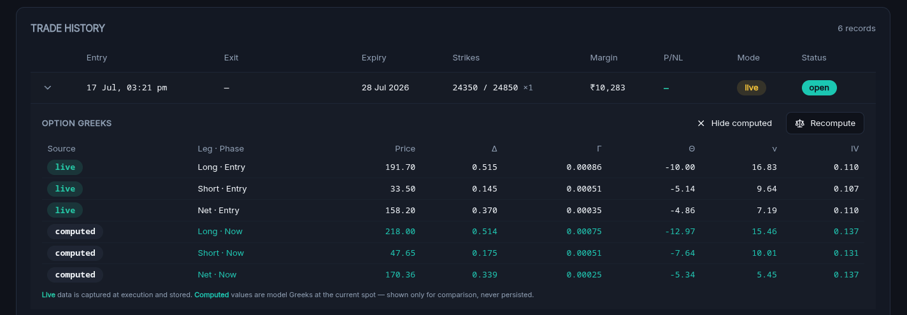

# OBCS-Nifty — Frontend

Dashboard for the **Overnight Bull Call Spread** options strategy on the NIFTY
index. Monitors live strategy state, P&L, and trade history, and controls the
runner (start / stop / paper enter / paper exit).

- **Framework:** Nuxt 4 (Vue 3, `<script setup>`)
- **Auth / realtime:** Supabase (`@nuxtjs/supabase`) — bearer token forwarded to
  the Go backend via `useApi()`; Realtime pushes refresh the dashboard on writes
- **Styling:** Tailwind (`@nuxtjs/tailwindcss`) with shadcn-vue design tokens
- **Theme:** dark-first, light supported (`@nuxtjs/color-mode`, `dark`/`light` class)
- **Icons:** `lucide-vue-next`

## Design language

Futuristic, dark-first, OKX-inspired trading terminal. Material spacing and
elevation, generous negative space, and a single quiet teal glow anchored to the
top of the shell as the signature. Trading semantics: **teal = gain**,
**red = loss**, **amber = market holiday**. Numbers are always tabular
(`font-variant-numeric: tabular-nums`) so columns align like a ledger.

All colors are driven by CSS variables in `app/assets/css/tailwind.css` and
mapped in `tailwind.config.ts`. Use the semantic utilities (`text-gain`,
`text-loss`, `bg-card`, `bg-elevated`, `border-border`, `text-muted-foreground`,
`hsl(var(--chart-grid))`, …) rather than hardcoded hex/hsl so every element
respects the active theme. Both themes are hand-tuned — light is not an
auto-inversion of dark.

## Features

| Feature | Component |
| --- | --- |
| Summary stat tiles (equity, net P&L, win rate, open positions) | `ui/Stat.vue` |
| Strategy **Start / Stop** + paper Enter/Exit, live status, session start | `dashboard/StrategyControls.vue` |
| **Total runtime** clock (ticks live while running) | `dashboard/RuntimeClock.vue` |
| **Live P&L graph** — Daily bars ↔ Cumulative curve toggle, single ₹ axis, gridlines, crosshair + tooltip, live pulse | `dashboard/PnlChart.vue` |
| **P&L heatmap calendar** for the year with NSE **holiday tiles**, weekend shading, intensity legend, year summary | `dashboard/PnlHeatmap.vue` |
| **Trade history** — entry/exit datetime, expiry, strikes×lots, margin, P/NL, mode, status; expandable **live vs computed** Greeks | `dashboard/TradeTable.vue` |
| Dark / light toggle (every element theme-aware) | `components/ThemeToggle.vue` |

### Live vs computed option data

Per the strategy spec, **live** Greek snapshots (`delta, gamma, theta, vega, iv`,
price) are captured at execution and persisted. **Computed** Greeks are model
values at the *current* spot, fetched on demand from `GET /api/trades/:id/computed`
only when **Compare computed** is pressed in an expanded trade row, and are shown
for comparison only — never written to the database.



### Data visualization notes

The P&L chart deliberately avoids a dual-axis chart (a common charting mistake).
Daily and cumulative P&L share the same ₹ unit, so they are shown one at a time
on a single axis via the segmented toggle. Gain/loss is encoded by **position**
relative to the zero baseline in addition to color, so the reading survives
color-blindness and grayscale; a screen-reader data table backs the SVG.

## Structure

| Path | Purpose |
| --- | --- |
| `app/layouts/default.vue` | App shell: sticky header, signature glow, theme toggle, sign-out |
| `app/pages/index.vue` | Dashboard: page header, stat tiles, widget grid, Realtime wiring |
| `app/pages/login.vue`, `confirm.vue` | Supabase password auth + callback |
| `app/components/ui/` | shadcn-style primitives (Button, Card, Badge, Table, **Stat**, **Segmented**, **Skeleton**, Switch) |
| `app/components/dashboard/` | StrategyControls, RuntimeClock, PnlChart, PnlHeatmap, TradeTable |
| `app/composables/useApi.ts` | Authenticated `$fetch` wrapper to the backend |
| `app/types.ts` | API contract types (mirror the Go models in `internal/models`) |

## Accessibility

- Keyboard focus is visible on every interactive element (`focus-visible:ring`).
- `prefers-reduced-motion` disables the pulse/ping and transitions.
- The chart exposes an `aria-label` summary plus an `sr-only` data table.
- Icon-only controls carry `aria-label`; the theme toggle renders a stable
  fallback before hydration to avoid a flash.

## Configuration

| Env var | Default | Notes |
| --- | --- | --- |
| `NUXT_PUBLIC_API_BASE` | `http://localhost:8080` | Go backend base URL (baked at build) |
| `SUPABASE_URL` | `http://localhost:8000` | Public Supabase gateway (baked at build) |
| `SUPABASE_KEY` | — | Supabase anon key (**required** — the app 500s without a valid key) |
| `NUXT_SUPABASE_COOKIE_SECURE` | `true` | Session-cookie `Secure` flag (baked at build). See below. |

> These are compiled into the SPA at **build time** (`ssr: false`), so changing
> any of them requires a **rebuild** of the frontend image — a container restart
> alone won't pick them up.

## Secure cookies in production

The Supabase session lives in an `sb-*-auth-token` cookie written by the browser
client. `@nuxtjs/supabase` marks it `Secure` by default. Browsers **only keep
`Secure` cookies on a secure context** — `http://localhost` counts, but a public
IP/host over plain **HTTP does not**, so the cookie is silently dropped and login
bounces straight back to `/login`.

The flag is driven by `NUXT_SUPABASE_COOKIE_SECURE` in `nuxt.config.ts`:

```ts
// nuxt.config.ts → supabase.cookieOptions
cookieOptions: {
  sameSite: 'lax',
  secure: process.env.NUXT_SUPABASE_COOKIE_SECURE !== 'false', // secure by default
},
```

| Deployment | Setting | Why |
| --- | --- | --- |
| **Production over HTTPS** (recommended — e.g. behind Caddy/Cloudflare) | leave unset / `true` | Session cookie is `Secure`; the correct, safe default. |
| Local dev on `localhost` | leave unset / `true` | `localhost` is a secure context, so `Secure` works even over HTTP. |
| Plain **HTTP** on a public host (trusted network only) | `NUXT_SUPABASE_COOKIE_SECURE=false` | Lets the cookie persist over HTTP. **Insecure** — the token travels in cleartext; use TLS instead wherever possible. |

Because it is baked at build time, set it as a Docker **build arg**:

```bash
docker build --build-arg NUXT_SUPABASE_COOKIE_SECURE=false -t obcs-frontend ./OBCS-frontend
```

The production stack (`docker-compose.prod.yml`) terminates TLS at Caddy and
serves everything over HTTPS on one domain, so it forces the secure default —
you don't need to set anything.

## Production deployment

`docker-compose.prod.yml` (repo root) runs the whole stack behind a single Caddy
reverse proxy that obtains Let's Encrypt certs via the Cloudflare DNS-01
challenge. Caddy is the only service with published host ports; the SPA, the Go
API, and the Supabase gateway are all served same-origin under one `$DOMAIN`
(`/`, `/api/*`, `/auth|/rest|/realtime|/storage`). See that file's header and
`.env.example` (Production section) for the required env.

## Develop

```bash
bun install
bun run dev      # http://localhost:3000
bun run build    # production build (type-checks all SFCs)
bun run preview
```
