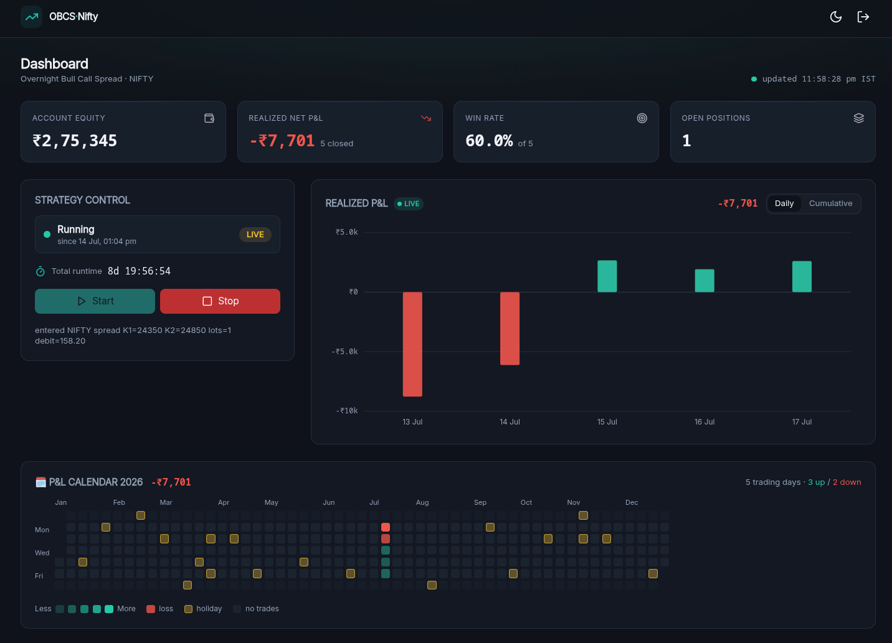

# OBCS-Nifty

Overnight Bull Call Spread (OBCS) strategy automation for the NIFTY index — a
full-stack app that ports the research model in `Backtest/simulator.py` into a
live/paper trading system.



- **Backend:** Go + Gin — strategy engine, AngelOne SmartAPI client, NSE holiday
  scraper, strategy runner goroutine, OpenAPI docs. Single writer to the DB.
- **Frontend:** Nuxt 4 + shadcn-style components — live PnL graph, trade history,
  year PnL/holiday heatmap, start/stop control, runtime clock, dark/light mode.
- **Data/Auth/Realtime:** Supabase (Postgres + GoTrue + PostgREST + Realtime).
- **Deploy:** Docker Compose.

> ⚠️ **Paper mode is the default.** Real AngelOne orders are placed only when
> `TRADING_MODE=live` **and** AngelOne credentials are configured. Prices in the
> model are Black-Scholes values, not traded quotes — validate before going live.

## Quickstart

```bash
cp .env.example .env      # then edit POSTGRES_PASSWORD, JWT_SECRET, keys, etc.
docker compose up -d --build
```

On first boot the backend:
1. applies DB migrations (schema + RLS + realtime publication),
2. scrapes the current-year NSE holiday calendar (static fallback if blocked),
3. provisions the single application user and **prints its credentials once** to
   the backend logs (`docker compose logs backend`). Save them — the password is
   not recoverable.

| Service        | URL                     |
|----------------|-------------------------|
| Frontend       | http://localhost:3000   |
| Backend API    | http://localhost:8080   |
| API docs       | http://localhost:8080/docs |
| Supabase (Kong)| http://localhost:8000   |
| Studio (opt.)  | `docker compose --profile studio up -d studio` → http://localhost:3001 |

## Development

```bash
# Backend
cd OBCS-backend && go test ./... && go run .

# Frontend
cd OBCS-frontend && bun install && bun run dev
```

## Security & docs

- Custom Semgrep ruleset: `semgrep scan --config semgrep/obcs-rules.yaml OBCS-backend OBCS-frontend/app`
- Data-flow diagram: `docs/dataflow.puml` · Threat model (STRIDE): `docs/threat-model.puml`
- Never commit `.env` (gitignored). The demo Supabase keys in `.env.example` are
  the public self-hosting defaults and must be regenerated for production.

## Repository layout

```
OBCS-backend/    Go/Gin API + strategy engine (internal/strategy is the OBCS math)
OBCS-frontend/   Nuxt 4 SPA (app/)
Backtest/        simulator.py — the authoritative research model
supabase/        self-hosted Supabase init (db roles/realtime, kong gateway)
docs/            PlantUML data-flow + threat model
semgrep/         custom security ruleset
docker-compose.yml
```
